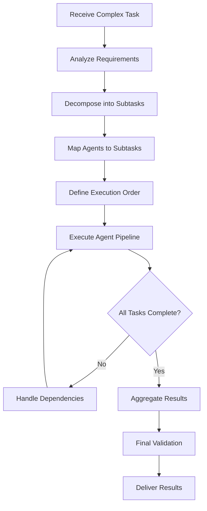

# Agent Coordination Process

This process defines how to effectively coordinate multiple specialized agents to accomplish complex tasks, ensuring smooth handoffs and optimal results.

## Overview

Complex tasks often require multiple specialized agents working in sequence or parallel. This process ensures:
- Proper task decomposition
- Clear agent selection
- Smooth information handoff
- Quality validation at each step

## Process Flow



## Step-by-Step Process

### 1. Task Analysis Phase

**Identify task components and requirements:**

```markdown
## Task Breakdown
Task: Create a new user authentication system

Components:
1. Database schema design
2. API endpoint implementation  
3. Frontend integration
4. Security review
5. Test coverage
6. Documentation

Required Agents:
- `system-architect` - Overall design
- `database-admin` - Schema creation
- `python-specialist` - Backend implementation
- `frontend-developer` - UI components
- `security-scanner` - Vulnerability check
- `unit-test-writer` - Test creation
- `documentation-writer` - API docs
```

### 2. Agent Mapping Strategy

**Match agents to specific subtasks:**

```yaml
task_pipeline:
  - stage: design
    agents:
      - name: system-architect
        output: architecture_design.md
        
  - stage: implementation
    parallel: true
    agents:
      - name: python-specialist
        input: architecture_design.md
        output: backend_code/
      - name: frontend-developer
        input: architecture_design.md
        output: frontend_code/
        
  - stage: quality
    agents:
      - name: security-scanner
        input: [backend_code/, frontend_code/]
        output: security_report.md
      - name: unit-test-writer
        input: [backend_code/, frontend_code/]
        output: tests/
        
  - stage: documentation
    agents:
      - name: documentation-writer
        input: all_previous_outputs
        output: docs/
```

### 3. Information Handoff Protocol

**Ensure smooth data transfer between agents:**

```markdown
## Handoff Template
---
From Agent: python-specialist
To Agent: unit-test-writer
Task Context: User authentication API implementation

Delivered Artifacts:
- /src/auth/models.py - User and Session models
- /src/auth/views.py - Authentication endpoints
- /src/auth/utils.py - Helper functions

Key Information:
- Authentication uses JWT tokens
- Password hashing with bcrypt
- Session timeout: 24 hours
- Rate limiting: 5 attempts per minute

Special Considerations:
- Test edge cases for password reset flow
- Mock external email service
- Validate JWT expiration handling
---
```

### 4. Parallel Execution Guidelines

**When agents can work simultaneously:**

```markdown
## Parallel Execution Rules

### Can Run in Parallel:
- Frontend and backend development (same spec)
- Unit tests and integration tests
- Documentation and deployment setup
- Multiple language specialists on different modules

### Must Run Sequentially:
- Design → Implementation
- Implementation → Testing
- Security scan → Security fixes
- All development → Deployment

### Coordination Points:
- Shared interfaces must be defined first
- API contracts agreed before parallel work
- Regular sync points for integration
```

### 5. Quality Gates

**Validation between agent handoffs:**

```markdown
## Quality Gate Checklist

### After Design Phase:
- [ ] Architecture documented
- [ ] Interfaces defined
- [ ] Dependencies identified
- [ ] Performance requirements clear

### After Implementation:
- [ ] Code compiles/runs
- [ ] Basic functionality works
- [ ] Follows coding standards
- [ ] No obvious security issues

### After Testing:
- [ ] Test coverage > 80%
- [ ] All tests passing
- [ ] Edge cases covered
- [ ] Performance benchmarks met

### Before Deployment:
- [ ] Security scan passed
- [ ] Documentation complete
- [ ] Rollback plan defined
- [ ] Monitoring configured
```

## Common Coordination Patterns

### 1. Pipeline Pattern
Sequential processing through specialized agents:

```
User Story → system-architect → backend-developer → frontend-developer → test-writer → documentation-writer
```

### 2. Fork-Join Pattern
Parallel processing with synchronization:

```
Specification ──┬→ python-specialist ──┬→ integration-test-writer → Deployment
                ├→ javascript-specialist┤
                └→ database-engineer ───┘
```

### 3. Iterative Pattern
Cyclic refinement between agents:

```
code-writer ←→ code-reviewer ←→ performance-optimizer
     ↓              ↓                    ↓
  (iterate until quality threshold met)
```

### 4. Hierarchical Pattern
Master agent coordinating sub-agents:

```
platform-redesigner
    ├── ux-optimizer (UI/UX improvements)
    ├── performance-optimizer (speed enhancements)
    ├── security-scanner (vulnerability fixes)
    └── accessibility-auditor (compliance updates)
```

## Agent Communication Standards

### Context Preservation
Each agent should maintain and pass forward:

```markdown
## Context Object
```json
{
  "task_id": "auth-system-2024-01",
  "overall_goal": "Implement secure user authentication",
  "constraints": {
    "timeline": "2 weeks",
    "tech_stack": ["Python", "FastAPI", "PostgreSQL", "React"],
    "requirements": ["GDPR compliant", "OAuth support"]
  },
  "completed_steps": [
    {
      "agent": "system-architect",
      "output": "design_doc.md",
      "key_decisions": ["JWT for sessions", "PostgreSQL for user data"]
    }
  ],
  "pending_tasks": ["Frontend implementation", "Security review"],
  "blockers": [],
  "notes": "Client prefers minimal external dependencies"
}
```
```

### Error Handling
How agents handle and communicate failures:

```markdown
## Error Communication Protocol

When an agent encounters an error:
1. Document the specific issue
2. Identify if it blocks other agents
3. Suggest alternative approaches
4. Pass error context to coordinator

Error Report Format:
```yaml
error:
  agent: python-specialist
  task: implement_oauth
  type: dependency_conflict
  severity: blocking
  description: "OAuth library conflicts with existing auth system"
  attempted_solutions:
    - "Tried upgrading to v2.0 - breaks other features"
    - "Attempted compatibility mode - performance issues"
  recommendations:
    - "Use alternative OAuth library"
    - "Implement custom OAuth handler"
    - "Delay OAuth to phase 2"
  impact:
    - frontend-developer: "Blocked on auth flow"
    - test-writer: "Cannot write OAuth tests"
```
```

## Optimization Strategies

### 1. Agent Selection Optimization
Choose the most specific agent for each task:

```markdown
Task: "Write Python API endpoint"
❌ general-purpose agent (too broad)
❌ code-refactorer (wrong purpose)
✅ python-specialist (optimal match)
```

### 2. Batch Similar Tasks
Group similar work for single agent:

```markdown
Instead of:
- python-specialist: Create user model
- python-specialist: Create auth endpoints
- python-specialist: Create middleware

Better:
- python-specialist: Create all auth components (models, endpoints, middleware)
```

### 3. Minimize Handoffs
Reduce context switching overhead:

```markdown
Poor Flow (6 handoffs):
architect → backend → reviewer → backend → tester → backend → deployer

Better Flow (3 handoffs):
architect → backend (implement + self-review) → tester → deployer
```

## Monitoring and Metrics

### Track Coordination Efficiency

```markdown
## Coordination Metrics

1. **Handoff Success Rate**
   - Successful handoffs / Total handoffs
   - Target: > 95%

2. **Rework Rate**
   - Tasks sent back / Total tasks
   - Target: < 10%

3. **Pipeline Duration**
   - Time from start to completion
   - Compare to sum of individual task times

4. **Agent Utilization**
   - Active time / Total pipeline time
   - Identify bottlenecks

5. **Quality Gates Passed**
   - First-time pass rate
   - Target: > 80%
```

## Best Practices

### DO:
- Define clear interfaces between agents
- Document assumptions and decisions
- Validate outputs before handoff
- Maintain task context throughout pipeline
- Plan for failure scenarios

### DON'T:
- Skip quality gates for speed
- Assume agents understand implicit context
- Create overly complex coordination flows
- Ignore agent specializations
- Forget error handling

## Troubleshooting Guide

### Common Issues and Solutions

**Issue: Agents producing incompatible outputs**
- Solution: Define strict interface contracts
- Use validation schemas between stages

**Issue: Lost context between handoffs**
- Solution: Implement context object pattern
- Each agent adds to shared context

**Issue: Circular dependencies**
- Solution: Map dependencies upfront
- Use topological sort for execution order

**Issue: Performance bottlenecks**
- Solution: Identify sequential constraints
- Maximize parallel execution opportunities

Remember: Effective agent coordination multiplies the capabilities of individual agents. The goal is seamless collaboration that produces results greater than the sum of parts.